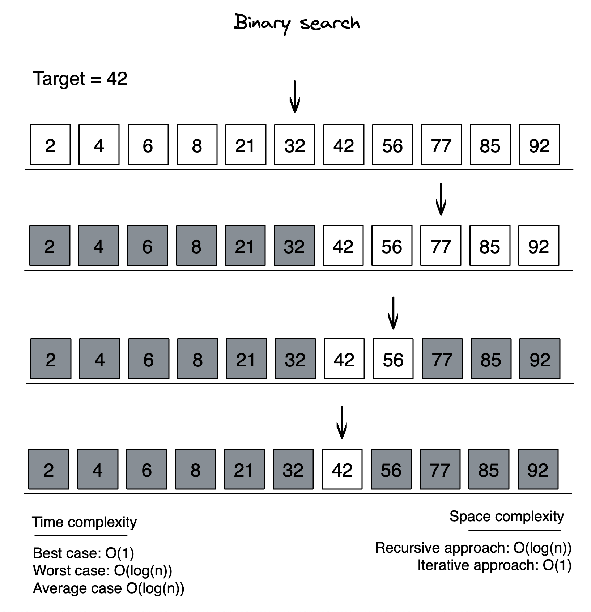

# Binary search



Steps:

Step 1 - Read the search element from the user.
Step 2 - Find the middle element in the sorted list.
Step 3 - Compare the search element with the middle element in the sorted list.
Step 4 - If both are matched, then display "Given element is found!!!" and terminate the function.
Step 5 - If both are not matched, then check whether the search element is smaller or larger than the middle element.
Step 6 - If the search element is smaller than middle element, repeat steps 2, 3, 4 and 5 for the left sublist of the middle element.
Step 7 - If the search element is larger than middle element, repeat steps 2, 3, 4 and 5 for the right sublist of the middle element.
Step 8 - Repeat the same process until we find the search element in the list or until sublist contains only one element.
Step 9 - If that element also doesn't match with the search element, then returns -1;

Time Complexity:

Worst case: O(log n)
Average case: O(log n)
Best case: O(1)

```typescript

function binarySearch(nums: number[], target: number): number {
  let left: number = 0;
  let right: number = nums.length - 1;

  while (left <= right) {
    const mid: number = Math.floor((left + right) / 2);

    if (nums[mid] === target) return mid;
    if (target < nums[mid]) right = mid - 1;
    else left = mid + 1;
  }

  return -1;
}

```

```java

class Solution {
    private static int binarySearch(int[] array, int target) {
		
		int low = 0;
		int high = array.length - 1;
		
		while(low <= high) {
			int middle = low + (high - low) / 2;
			int value = array[middle];
			
			if(value < target) {
				low = middle + 1;
			} else if(value > target) {
				high = middle - 1;
				
			} else {
				return middle;
			}
		}
		return -1;
	}
}
```

* [Go back](../readme.md)