# Sorting Algorithms: Quick Sort & Merge Sort

This document provides a comprehensive overview of Quick Sort and Merge Sort algorithms, including both simple and optimized implementations with detailed Mermaid diagrams.

## Table of Contents

1. [Algorithm Overview](#algorithm-overview)
2. [Quick Sort](#quick-sort)
3. [Merge Sort](#merge-sort)
4. [Algorithm Comparison](#algorithm-comparison)
5. [Implementation Structure](#implementation-structure)
6. [Performance Analysis](#performance-analysis)
7. [Memory Usage](#memory-usage)
8. [Educational Progression](#educational-progression)
9. [Usage Examples](#usage-examples)
10. [Running the Tests](#running-the-tests)
11. [When to Use Each Algorithm](#when-to-use-each-algorithm)

## Algorithm Overview

This directory contains both simple and optimized implementations of Quick Sort and Merge Sort in JavaScript, Python, and TypeScript.

### Available Implementations

| Algorithm | Simple Version | Optimized Version |
|-----------|---------------|-------------------|
| **Quick Sort** | First element pivot | Median-of-three pivot |
| **Merge Sort** | Basic divide-and-conquer | Enhanced merge with stability |

### Time & Space Complexity

| Algorithm | Time Complexity | Space Complexity | Stability |
|-----------|----------------|------------------|-----------|
| **Quick Sort** | O(n log n) avg, O(n²) worst | O(log n) avg | No |
| **Merge Sort** | O(n log n) always | O(n) | Yes |

## Quick Sort

### Quick Sort Optimizations

#### 1. **Median-of-Three Pivot Selection** (Optimized Version)
- Instead of always choosing the middle element as pivot, we use the median of first, middle, and last elements
- This helps avoid worst-case scenarios (O(n²)) when the array is already sorted or reverse sorted
- Improves average-case performance significantly

#### 2. **Improved Base Case**
- Changed from `arr.length < 2` to `arr.length <= 1` for better clarity
- More explicit handling of edge cases

#### 3. **Better Code Structure**
- Separated pivot selection logic into its own function
- Added comprehensive documentation and type annotations
- Improved readability and maintainability

### Simple Quick Sort Flow

```mermaid
flowchart TD
    A[Start: Array] --> B{Array length <= 1?}
    B -->|Yes| C[Return array as is]
    B -->|No| D[Choose pivot: arr[0]]
    D --> E[Partition array]
    E --> F[Create less array]
    E --> G[Create equal array]
    E --> H[Create greater array]
    F --> I[Recursive call: simpleQuickSort less]
    G --> J[Keep equal elements]
    H --> K[Recursive call: simpleQuickSort greater]
    I --> L[Combine: less + equal + greater]
    J --> L
    K --> L
    L --> M[Return sorted array]
    C --> N[End]
    M --> N
```

### Optimized Quick Sort Flow

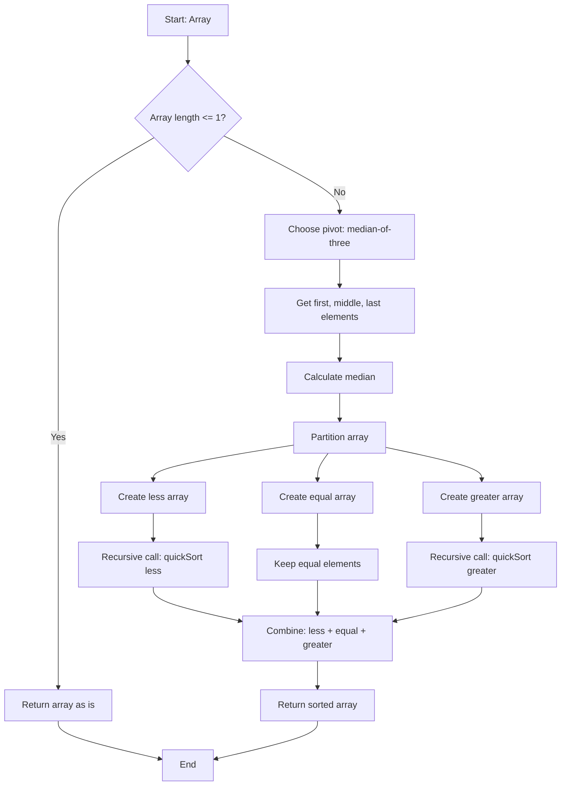

### Quick Sort Step-by-Step Example: [3, 5, 1, 6, 192, 54, 213, 5]

#### Simple Quick Sort Execution

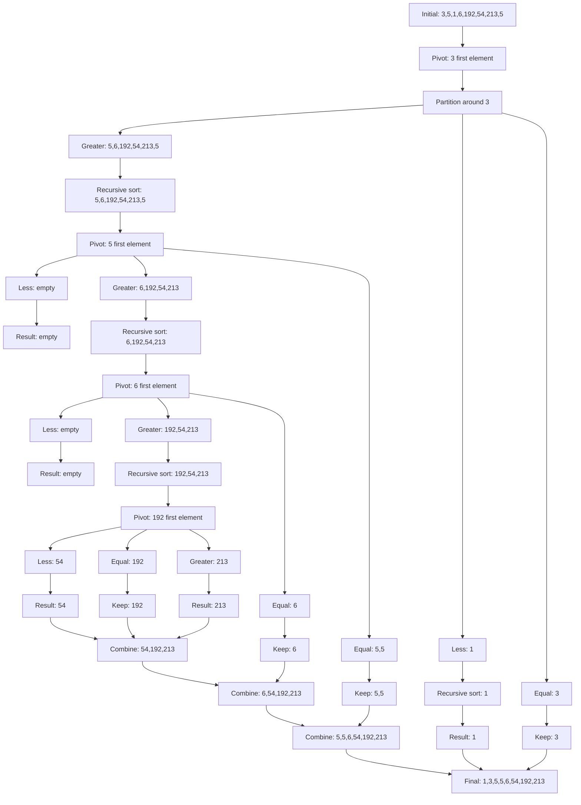

#### Optimized Quick Sort Execution

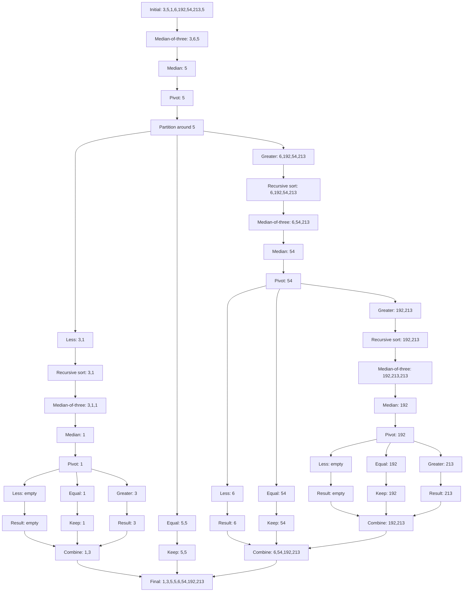

### Median-of-Three Pivot Selection

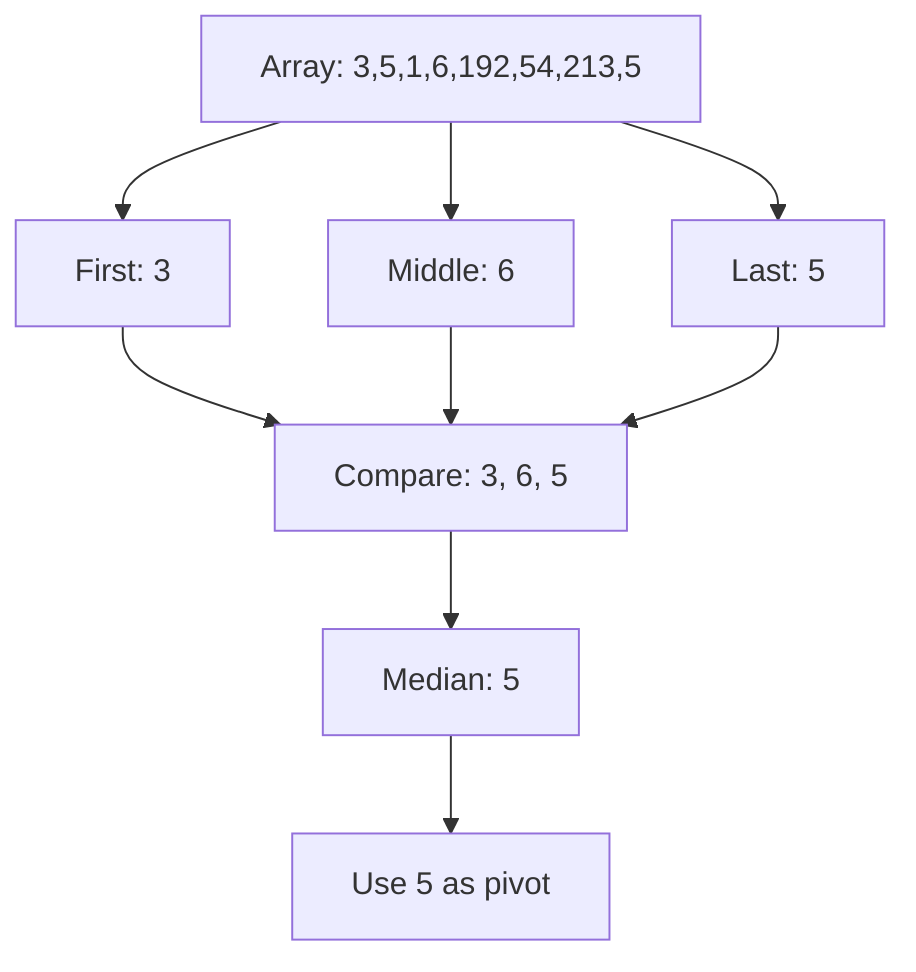

## Merge Sort

### Merge Sort Optimizations

#### 1. **Stable Sorting** (Optimized Version)
- Preserves the order of equal elements
- Important for complex data structures

#### 2. **Better Memory Management**
- More explicit handling of remaining elements
- Clearer separation of merge logic

#### 3. **Enhanced Merge Function**
- Explicit loops for remaining elements
- Better readability and maintainability

### Simple Merge Sort Flow

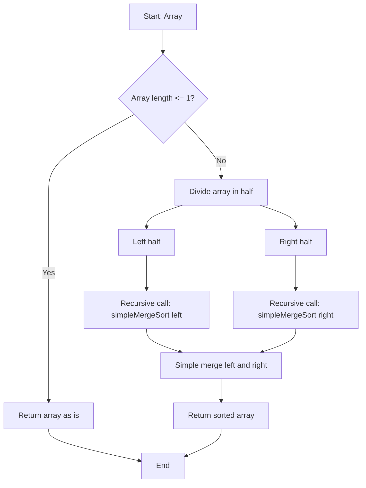

### Optimized Merge Sort Flow

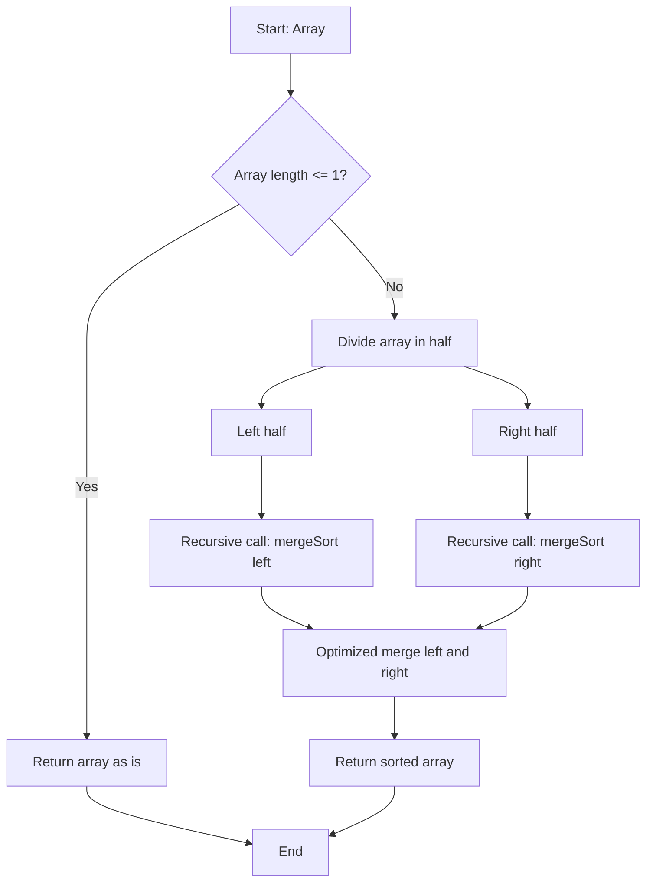

### Merge Sort Step-by-Step Example: [3, 5, 1, 6, 192, 54, 213, 5]

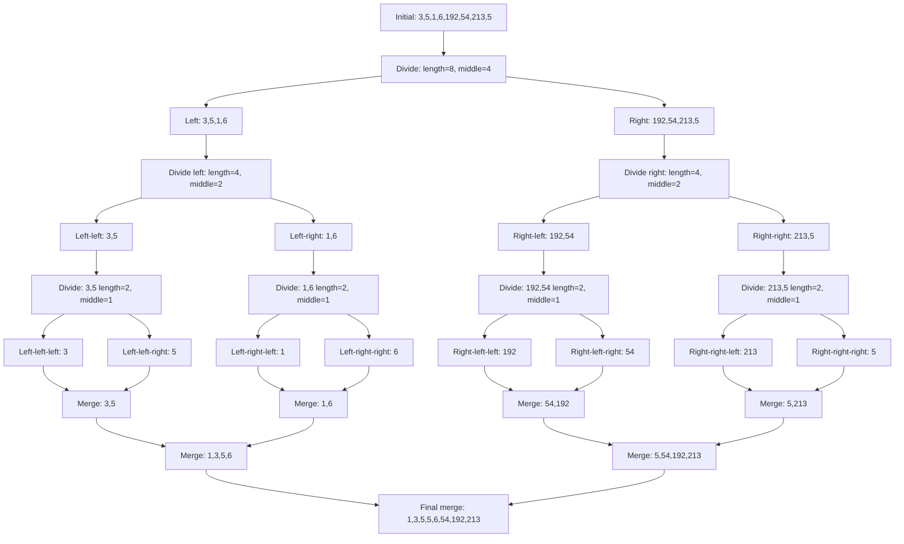

### Merge Process Comparison

#### Simple Merge: [1,3,5] + [2,4,6]

```mermaid
flowchart LR
    A[Left: 1,3,5] --> C[Compare: 1 <= 2?]
    B[Right: 2,4,6] --> C
    C -->|Yes| D[Take 1 from left]
    C -->|No| E[Take 2 from right]
    D --> F[Result: 1]
    E --> G[Result: 2]
    F --> H[Compare: 3 <= 2?]
    G --> I[Compare: 1 <= 4?]
    H -->|No| J[Take 2 from right]
    I -->|Yes| K[Take 3 from left]
    J --> L[Result: 1,2]
    K --> M[Result: 2,1]
    L --> N[Compare: 3 <= 4?]
    M --> O[Compare: 2 <= 4?]
    N -->|Yes| P[Take 3 from left]
    O -->|Yes| Q[Take 2 from right]
    P --> R[Result: 1,2,3]
    Q --> S[Result: 1,2,3]
    R --> T[Compare: 5 <= 4?]
    S --> U[Compare: 3 <= 4?]
    T -->|No| V[Take 4 from right]
    U -->|Yes| W[Take 4 from right]
    V --> X[Result: 1,2,3,4]
    W --> Y[Result: 1,2,3,4]
    X --> Z[Compare: 5 <= 6?]
    Y --> AA[Compare: 5 <= 6?]
    Z -->|Yes| BB[Take 5 from left]
    AA -->|Yes| CC[Take 5 from left]
    BB --> DD[Result: 1,2,3,4,5]
    CC --> EE[Result: 1,2,3,4,5]
    DD --> FF[Take remaining: 6]
    EE --> GG[Take remaining: 6]
    FF --> HH[Final: 1,2,3,4,5,6]
    GG --> HH
```

#### Optimized Merge: [1,3,5] + [2,4,6]

```mermaid
flowchart LR
    A[Left: 1,3,5] --> C[Compare: 1 <= 2?]
    B[Right: 2,4,6] --> C
    C -->|Yes| D[Take 1 from left]
    C -->|No| E[Take 2 from right]
    D --> F[Result: 1]
    E --> G[Result: 2]
    F --> H[Compare: 3 <= 2?]
    G --> I[Compare: 1 <= 4?]
    H -->|No| J[Take 2 from right]
    I -->|Yes| K[Take 3 from left]
    J --> L[Result: 1,2]
    K --> M[Result: 2,1]
    L --> N[Compare: 3 <= 4?]
    M --> O[Compare: 2 <= 4?]
    N -->|Yes| P[Take 3 from left]
    O -->|Yes| Q[Take 2 from right]
    P --> R[Result: 1,2,3]
    Q --> S[Result: 1,2,3]
    R --> T[Compare: 5 <= 4?]
    S --> U[Compare: 3 <= 4?]
    T -->|No| V[Take 4 from right]
    U -->|Yes| W[Take 4 from right]
    V --> X[Result: 1,2,3,4]
    W --> Y[Result: 1,2,3,4]
    X --> Z[Compare: 5 <= 6?]
    Y --> AA[Compare: 5 <= 6?]
    Z -->|Yes| BB[Take 5 from left]
    AA -->|Yes| CC[Take 5 from left]
    BB --> DD[Result: 1,2,3,4,5]
    CC --> EE[Result: 1,2,3,4,5]
    DD --> FF[Explicit loop: Add remaining 6]
    EE --> GG[Explicit loop: Add remaining 6]
    FF --> HH[Final: 1,2,3,4,5,6]
    GG --> HH
```

## Algorithm Comparison

### Time Complexity Comparison

```mermaid
graph LR
    A[Input Size] --> B[Quick Sort: O(n log n) avg]
    A --> C[Merge Sort: O(n log n) always]
    A --> D[Quick Sort: O(n²) worst]
    B --> E[Random data: Excellent]
    C --> F[All cases: Predictable]
    D --> G[Sorted data: Poor]
```

### Space Complexity Comparison

```mermaid
graph TD
    A[Memory Usage] --> B[Quick Sort: O(log n) avg]
    A --> C[Merge Sort: O(n)]
    B --> D[In-place operations]
    C --> E[Additional space needed]
    D --> F[Better for limited memory]
    E --> G[Stable sorting advantage]
```

### Stability Comparison

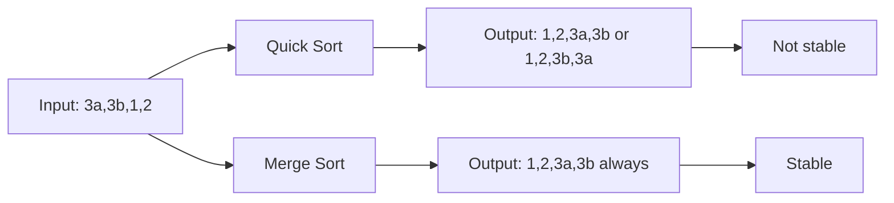

### Performance by Input Type

#### Quick Sort Performance Scenarios

```mermaid
graph TD
    A[Input Type] --> B[Random Data]
    A --> C[Already Sorted]
    A --> D[Reverse Sorted]
    A --> E[Many Duplicates]
    B --> F[Simple: Good]
    B --> G[Optimized: Excellent]
    C --> H[Simple: Poor O(n²)]
    C --> I[Optimized: Good O(n log n)]
    D --> J[Simple: Poor O(n²)]
    D --> K[Optimized: Good O(n log n)]
    E --> L[Simple: Variable]
    E --> M[Optimized: Good]
```

#### Merge Sort Performance Scenarios

```mermaid
graph TD
    A[Input Type] --> B[Random Data]
    A --> C[Already Sorted]
    A --> D[Reverse Sorted]
    A --> E[Many Duplicates]
    B --> F[Simple: Consistent O(n log n)]
    B --> G[Optimized: Consistent O(n log n)]
    C --> H[Simple: Consistent O(n log n)]
    C --> I[Optimized: Consistent O(n log n)]
    D --> J[Simple: Consistent O(n log n)]
    D --> K[Optimized: Consistent O(n log n)]
    E --> L[Simple: Consistent O(n log n)]
    E --> M[Optimized: Consistent O(n log n)]
```

## Implementation Structure

### JavaScript Implementation Structure

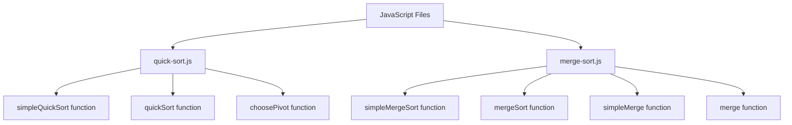

### Python Implementation Structure

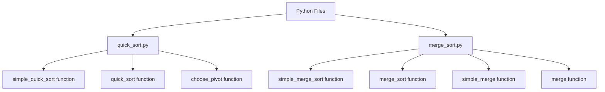

### TypeScript Implementation Structure


## Performance Analysis

### Quick Sort Performance by Input Type

```mermaid
graph TD
    A[Input: 1,2,3,4,5] --> B[Simple Quick Sort]
    A --> C[Optimized Quick Sort]
    B --> D[Pivot: 1 first element]
    C --> E[Pivot: 3 median-of-three]
    D --> F[Partition: empty + 1 + 2,3,4,5]
    E --> G[Partition: 1,2 + 3 + 4,5]
    F --> H[Recursive: 2,3,4,5]
    G --> I[Recursive: 1,2 and 4,5]
    H --> J[Pivot: 2 first element]
    I --> K[Pivot: 1 and 4 median-of-three]
    J --> L[Partition: empty + 2 + 3,4,5]
    K --> M[Partition: empty + 1 + 2 and empty + 4 + 5]
    L --> N[Recursive: 3,4,5]
    M --> O[Recursive: 2 and 5]
    N --> P[Pivot: 3 first element]
    O --> Q[Pivot: 2 and 5 median-of-three]
    P --> R[Partition: empty + 3 + 4,5]
    Q --> S[Partition: empty + 2 + empty and empty + 5 + empty]
    R --> T[Recursive: 4,5]
    S --> U[Recursive: empty and empty]
    T --> V[Pivot: 4 first element]
    U --> W[Result: 2,5]
    V --> X[Partition: empty + 4 + 5]
    W --> Y[Combine: 1,2,5]
    X --> Z[Recursive: 5]
    Y --> AA[Final: 1,2,3,4,5]
    Z --> BB[Result: 5]
    AA --> CC[Combine: 1,2,3,4,5]
    BB --> CC
    CC --> DD[Simple: O(n²) performance]
    CC --> EE[Optimized: O(n log n) performance]
```

### Merge Sort Performance by Input Type

```mermaid
graph TD
    A[Input: 1,2,3,4,5] --> B[Simple Merge Sort]
    A --> C[Optimized Merge Sort]
    B --> D[Divide: 1,2,3 and 4,5]
    C --> E[Divide: 1,2,3 and 4,5]
    D --> F[Divide: 1,2 and 3]
    E --> G[Divide: 1,2 and 3]
    F --> H[Divide: 1 and 2]
    G --> I[Divide: 1 and 2]
    H --> J[Merge: 1,2]
    I --> K[Merge: 1,2]
    J --> L[Merge: 1,2,3]
    K --> M[Merge: 1,2,3]
    L --> N[Merge: 1,2,3,4,5]
    M --> O[Merge: 1,2,3,4,5]
    D --> P[Divide: 4 and 5]
    E --> Q[Divide: 4 and 5]
    P --> R[Merge: 4,5]
    Q --> S[Merge: 4,5]
    R --> T[Final: 1,2,3,4,5]
    S --> U[Final: 1,2,3,4,5]
    N --> T
    O --> U
    T --> V[Simple: O(n log n) performance]
    U --> W[Optimized: O(n log n) performance]
```

## Memory Usage

### Quick Sort Memory Stack

```mermaid
graph TD
    A[Level 0: 3,5,1,6,192,54,213,5] --> B[Pivot: 5]
    B --> C[Less: 3,1]
    B --> D[Equal: 5,5]
    B --> E[Greater: 6,192,54,213]
    C --> F[Level 1: 3,1]
    E --> G[Level 1: 6,192,54,213]
    F --> H[Pivot: 3]
    G --> I[Pivot: 6]
    H --> J[Less: 1]
    H --> K[Equal: 3]
    I --> L[Less: empty]
    I --> M[Equal: 6]
    I --> N[Greater: 192,54,213]
    J --> O[Level 2: 1]
    N --> P[Level 2: 192,54,213]
    O --> Q[Result: 1]
    P --> R[Pivot: 192]
    R --> S[Less: 54]
    R --> T[Equal: 192]
    R --> U[Greater: 213]
    S --> V[Level 3: 54]
    U --> W[Level 3: 213]
    V --> X[Result: 54]
    W --> Y[Result: 213]
    X --> Z[Combine: 54,192,213]
    T --> Z
    Y --> Z
    Z --> AA[Combine: 6,54,192,213]
    M --> AA
    AA --> BB[Combine: 5,5,6,54,192,213]
    D --> BB
    Q --> CC[Combine: 1,3]
    K --> CC
    CC --> DD[Final: 1,3,5,5,6,54,192,213]
    BB --> DD
```

### Merge Sort Memory Usage

```mermaid
graph TD
    A[Level 0: 3,5,1,6,192,54,213,5] --> B[Divide: 3,5,1,6 and 192,54,213,5]
    B --> C[Level 1 Left: 3,5,1,6]
    B --> D[Level 1 Right: 192,54,213,5]
    C --> E[Divide: 3,5 and 1,6]
    D --> F[Divide: 192,54 and 213,5]
    E --> G[Level 2 Left: 3,5]
    E --> H[Level 2 Right: 1,6]
    F --> I[Level 2 Left: 192,54]
    F --> J[Level 2 Right: 213,5]
    G --> K[Divide: 3 and 5]
    H --> L[Divide: 1 and 6]
    I --> M[Divide: 192 and 54]
    J --> N[Divide: 213 and 5]
    K --> O[Level 3 Left: 3]
    K --> P[Level 3 Right: 5]
    L --> Q[Level 3 Left: 1]
    L --> R[Level 3 Right: 6]
    M --> S[Level 3 Left: 192]
    M --> T[Level 3 Right: 54]
    N --> U[Level 3 Left: 213]
    N --> V[Level 3 Right: 5]
    O --> W[Merge: 3,5]
    P --> W
    Q --> X[Merge: 1,6]
    R --> X
    S --> Y[Merge: 54,192]
    T --> Y
    U --> Z[Merge: 5,213]
    V --> Z
    W --> AA[Merge: 1,3,5,6]
    X --> AA
    Y --> BB[Merge: 5,54,192,213]
    Z --> BB
    AA --> CC[Final merge: 1,3,5,5,6,54,192,213]
    BB --> CC
```

## Educational Progression

### Learning Path

```mermaid
flowchart TD
    A[Start Learning] --> B[Understand Basic Concepts]
    B --> C[Simple Quick Sort]
    B --> D[Simple Merge Sort]
    C --> E[Learn Pivot Selection]
    D --> F[Learn Divide and Conquer]
    E --> G[Optimized Quick Sort]
    F --> H[Optimized Merge Sort]
    G --> I[Understand Trade-offs]
    H --> I
    I --> J[Choose Right Algorithm]
    J --> K[Production Implementation]
```

## Files

### Quick Sort
- `js/quick-sort.js` - JavaScript implementation (both simple and optimized)
- `python/quick_sort.py` - Python implementation with type hints (both versions)
- `ts/quick-sort.ts` - TypeScript implementation with generics (both versions)

### Merge Sort
- `js/merge-sort.js` - JavaScript implementation (both simple and optimized)
- `python/merge_sort.py` - Python implementation with type hints (both versions)
- `ts/merge-sort.ts` - TypeScript implementation with generics (both versions)

### Documentation
- `diagrams.md` - High-level algorithm diagrams
- `step-by-step-diagrams.md` - Detailed execution flow diagrams

## Usage Examples

### Quick Sort

#### JavaScript
```javascript
// Simple version
const arr = [3, 5, 1, 6, 192, 54, 213, 5];
const sorted = simpleQuickSort(arr);

// Optimized version
const optimized = quickSort(arr);
console.log(sorted); // [1, 3, 5, 5, 6, 54, 192, 213]
```

#### Python
```python
# Simple version
arr = [3, 5, 1, 6, 192, 54, 213, 5]
sorted_arr = simple_quick_sort(arr)

# Optimized version
optimized = quick_sort(arr)
print(sorted_arr)  # [1, 3, 5, 5, 6, 54, 192, 213]
```

#### TypeScript
```typescript
// Simple version
const arr: number[] = [3, 5, 1, 6, 192, 54, 213, 5];
const sorted = simpleQuickSort(arr);

// Optimized version
const optimized = quickSort(arr);
console.log(sorted); // [1, 3, 5, 5, 6, 54, 192, 213]
```

### Merge Sort

#### JavaScript
```javascript
// Simple version
const arr = [3, 5, 1, 6, 192, 54, 213, 5];
const sorted = simpleMergeSort(arr);

// Optimized version
const optimized = mergeSort(arr);
console.log(sorted); // [1, 3, 5, 5, 6, 54, 192, 213]
```

#### Python
```python
# Simple version
arr = [3, 5, 1, 6, 192, 54, 213, 5]
sorted_arr = simple_merge_sort(arr)

# Optimized version
optimized = merge_sort(arr)
print(sorted_arr)  # [1, 3, 5, 5, 6, 54, 192, 213]
```

#### TypeScript
```typescript
// Simple version
const arr: number[] = [3, 5, 1, 6, 192, 54, 213, 5];
const sorted = simpleMergeSort(arr);

// Optimized version
const optimized = mergeSort(arr);
console.log(sorted); // [1, 3, 5, 5, 6, 54, 192, 213]
```

## Running the Tests

### Quick Sort
```bash
# JavaScript
cd js && node quick-sort.js

# Python
cd python && python3 quick_sort.py

# TypeScript
cd ts && npx tsx quick-sort.ts
```

### Merge Sort
```bash
# JavaScript
cd js && node merge-sort.js

# Python
cd python && python3 merge_sort.py

# TypeScript
cd ts && npx tsx merge-sort.ts
```

## Key Differences

| Aspect | Simple Version | Optimized Version |
|--------|---------------|-------------------|
| **Quick Sort - Pivot Selection** | First element (`arr[0]`) | Median-of-three |
| **Quick Sort - Worst Case Performance** | O(n²) on sorted arrays | Better performance |
| **Merge Sort - Stability** | Basic implementation | Stable sorting |
| **Merge Sort - Memory Management** | Basic | Enhanced |
| **Code Complexity** | Simpler, easier to understand | More sophisticated |
| **Educational Value** | Great for learning basics | Shows optimization techniques |
| **Real-world Usage** | Basic implementation | Production-ready |

## Key Features

1. **Language-Specific Optimizations**
   - JavaScript: Uses modern ES6+ features like `for...of` loops
   - Python: Includes type hints and comprehensive docstrings
   - TypeScript: Full type safety with generics

2. **Robust Error Handling**
   - Handles edge cases like empty arrays and single elements
   - Works with different data types (numbers, strings, floats)

3. **Educational Value**
   - Well-documented code with clear comments
   - Consistent structure across all implementations
   - Easy to understand and modify
   - Shows progression from simple to optimized

## Performance Notes

### Quick Sort
The median-of-three pivot selection strategy significantly improves performance on:
- Already sorted arrays
- Reverse sorted arrays
- Arrays with many duplicate elements

This makes the algorithm more practical for real-world use cases where data might not be randomly distributed.

### Merge Sort
- Always O(n log n) time complexity regardless of input
- Stable sorting preserves order of equal elements
- Better for linked lists and external sorting
- Predictable performance

## When to Use Each Algorithm

### Quick Sort
**Use when:**
- Average-case performance is priority
- In-place sorting is needed
- Memory is limited
- Data is randomly distributed

**Avoid when:**
- Stability is required
- Worst-case performance is critical
- Data is already sorted or nearly sorted

### Merge Sort
**Use when:**
- Stable sorting is required
- Predictable performance is needed
- Working with linked lists
- External sorting (large datasets)

**Avoid when:**
- Memory is very limited
- In-place sorting is required
- Simple sorting is sufficient

## When to Use Each Version

### Use Simple Version When:
- Learning the algorithm for the first time
- Teaching basic concepts
- Need a quick, simple implementation
- Performance is not critical

### Use Optimized Version When:
- Building production applications
- Dealing with potentially sorted data
- Performance is important
- Need robust, battle-tested code

## Testing Flow

```mermaid
flowchart TD
    A[Test Cases] --> B[Empty array]
    A --> C[Single element]
    A --> D[Multiple elements]
    A --> E[Duplicate elements]
    A --> F[Already sorted]
    A --> G[Reverse sorted]
    A --> H[Strings]
    A --> I[Floats]
    B --> J[Simple Version]
    C --> J
    D --> J
    E --> J
    F --> J
    G --> J
    H --> J
    I --> J
    B --> K[Optimized Version]
    C --> K
    D --> K
    E --> K
    F --> K
    G --> K
    H --> K
    I --> K
    J --> L[Compare Results]
    K --> L
    L --> M[Verify Correctness]
``` 