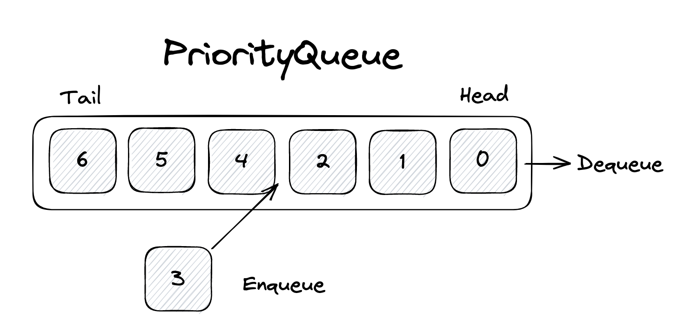

# Priority Queue




```typescript
export class PriorityQueue {
    private collection: any[] = []

    public printCollection() {
        return this.collection;
    }

    public enqueue(element: any) {
        if (this.isEmpty()) {
            return this.collection.push(element);
        }
        this.collection = this.collection.reverse()
        let index = this.collection.findIndex((item) => {
            return element[1] >= item[1];
        });
        if (index === -1) {
            this.collection.push(element);
        } else {
            this.collection.splice(index, 0, element);
        }
        this.collection = this.collection.reverse()
    }

    public dequeue() {
        if (!this.isEmpty()) {
            return this.collection.shift()[0];
        } else {
            return "The queue is empty.";
        }
    }

    public front():any {
        return this.collection[0][0]

    }

    public size(): number {
        return this.collection.length

    }

    public isEmpty(): boolean {
        return !this.size();

    }
}
```

* [Go back](../readme.md)