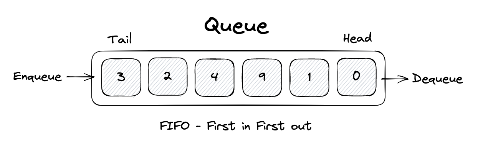

# Queue



```typescript
export class Queue {
    private collection: any[] = [];

    public print() {
        return this.collection;
    }

    public enqueue(element: any) {
        this.collection.push(element);
        return element;
    }

    public dequeue() {
        return this.collection.shift();
    }

    public front() {
        return this.collection[0];
    }

    public size() {
        return this.collection.length
    }

    public isEmpty() {
        return !this.collection.length
    }
}

```

* [Go back](../readme.md)