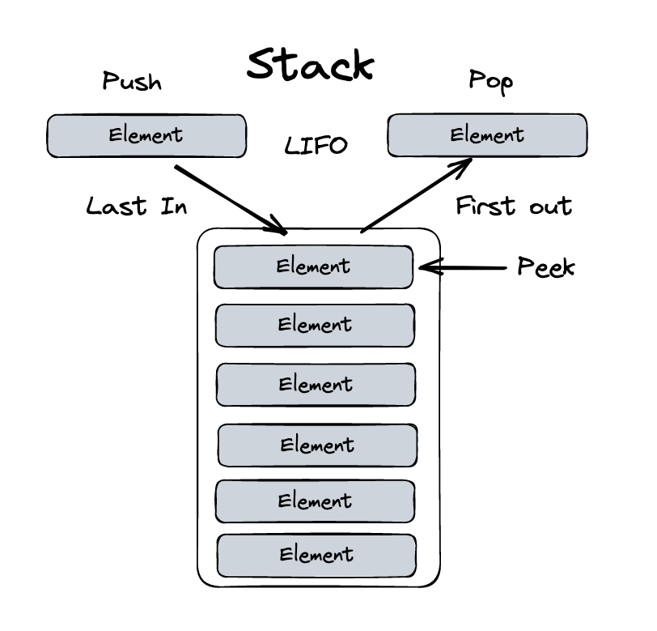

# Stack


```typescript
export class Stack {
    private collection:any[] = [];

    public print() {
        return this.collection;
    }

    public push(element: any) {
        this.collection.push(element);
        return element;
    }

    public pop() {
        return this.collection.pop();
    }

    public peek() {
        return this.collection[this.collection.length - 1];
    }

    public isEmpty() {
        return !this.collection.length;
    }

    public clear() {
        this.collection = []
    }
}

```

* [Go back](../readme.md)